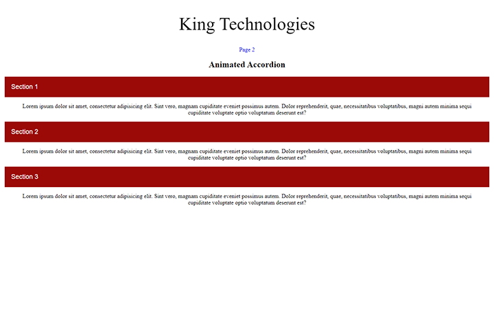

<p align="center">
  <a href="https://rohit19060.github.io/PWA-Template" title="PWA Template">
    
  </a>
</p>
<h1 align="center">🌟 PWA Template 🌟</h1>
<p align="center">App for PWA Templating</p>

<p align="center">
<a href="https://github.com/Rohit19060/PWA-Template/blob/master/LICENSE" title="License">

</a>
<a href="https://github.com/Rohit19060/PWA-Template/fork" title="Forks">

</a>
<a href="https://github.com/Rohit19060/PWA-Template/stargazers" title="Stars">

</a>
<a href="https://github.com/Rohit19060/PWA-Template/issues" title="Issues">

</a>
<a href="https://github.com/Rohit19060/PWA-Template/pulls" title="Pull Requests">

</a>
<a href="https://github.com/Rohit19060/PWA-Template" title="Repo Size">

</a>
<a href="https://discord.gg/2wpHNSjwm2" title="Join Community">

</a>
</p>

<p align="center" title="PWA Template"></p>

<h2 align="center">🌐 Links 🌐</h2>
<p align="center">
    <a href="https://github.com/Rohit19060/PWA-Template" title="PWA Template Repo">📂 Repo</a>
    ·
    <a href="https://rohit19060.github.io/PWA-Template" title="Visit">✨ Live View</a>
    ·
    <a href="https://github.com/Rohit19060/PWA-Template/issues/new/choose" title="🐛Report Bug/🎊Request Feature">🚀 Got Issue</a>
</p>

## 🚀 Features

- **You Can Use it as a Template**

- **Simplest PWA**

## 🦋 Prerequisite

- Basic Understanding of [HTML](https://youtu.be/JHv2jmnrLlA "HTML - First Step Towards Web Development")

- Basic Understanding of [CSS](https://youtu.be/d1tP7ow7HbQ "CSS - Second Step Towards Web Development")

- Basic Understanding of JavaScript

- Basic Understanding of [JSON](https://www.json.org/ "JSON")

## 🛠️ Installation Steps

1. Clone the repository

```Bash
git clone https://github.com/Rohit19060/PWA-Template.git
```

2. Change the working directory

```Bash
cd PWA-Template
```

3. Run the app in Browser

**🎇 You are Ready to Go!**

## ❗ Available Commands

Open the `index.html` file or you can use any local server (Live Server)

## 👷 Built with

- [HTML](https://youtu.be/JHv2jmnrLlA "HTML - First Step Towards Web Development"): For creating Markups

- [CSS](https://youtu.be/d1tP7ow7HbQ "CSS - Second Step Towards Web Development"): For Designing

- JavaScript: React is a JavaScript library.

- [JSON](https://www.json.org/ "JSON")

## 📂 Directory Structure

> [`./manifest.json`](https://github.com/Rohit19060/PWA-Template/blob/main/manifest.json "Manifest"): Main PWA File

> [`./serviceWorker.js`](https://github.com/Rohit19060/PWA-Template/blob/main/serviceWorker.js "Service Worker"): Service Worker File

> [`./script.js`](https://github.com/Rohit19060/PWA-Template/blob/mainscript.js "Script"): Main Script File

> [`./index.html`](https://github.com/Rohit19060/PWA-Template/blob/index.html "Index"): Entry Point

> [`./style.css`](https://github.com/Rohit19060/PWA-Template/blob/style.css "Style"): Styles File

## 🎊 Future Updates

- [ ] Add More PWA features

## 🧑🏻 Author

**Rohit Jain**

- 🌌 [Profile](https://github.com/Rohit19060 "Rohit Jain")

- 🏮 [Email](mailto:rohitjain19060@gmail.com?subject=Hi%20from%20PWA%20Template "Hi!")

- 🦁 [Website](https://kingtechnologies.in "Welcome")

<h2 align="center">🤝 Support</h2>

<h3 align="center">🎀 Contributions (<a href="https://guides.github.com/introduction/flow" title="GitHub flow">GitHub Flow</a>), 🔥 issues, and 🥮 feature requests are most welcome!</h3>

<h3 align="center">💙 If you like this project, Give it a ⭐ and Share it with friends!</h3>
<h3 align="center">💰 Donations Links</h3>
<p align="center">
<a href="https://www.paypal.me/kingrohitJ" title="PayPal"></a>
<a href="https://www.buymeacoffee.com/rohitjain" title="Buy me a Coffee"></a>
<a href="https://ko-fi.com/rohitjain" title="Ko-fi"></a>
</p>

<p align="center">Made with JavaScript & ❤️ in India</p>
